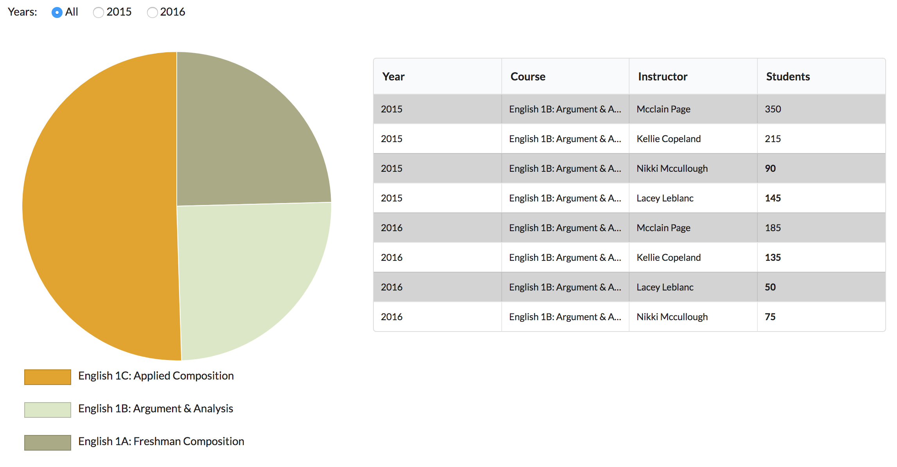

# WriteLab coding challenge

### Instructions to run

1. npm install
2. npm start

### Functionalities
1. A radio button group that allows the user to filter the data by year.
2. A chart that breaks down the number of students by course. The user can click on the chart to select a
specific course at any time.
3. A data grid displaying detailed student data for a specific course. The grid becomes visible only after
the user chooses a course. Show the number of students figures in bold if they are below average.
Also, use alternating background colors for the rows.
